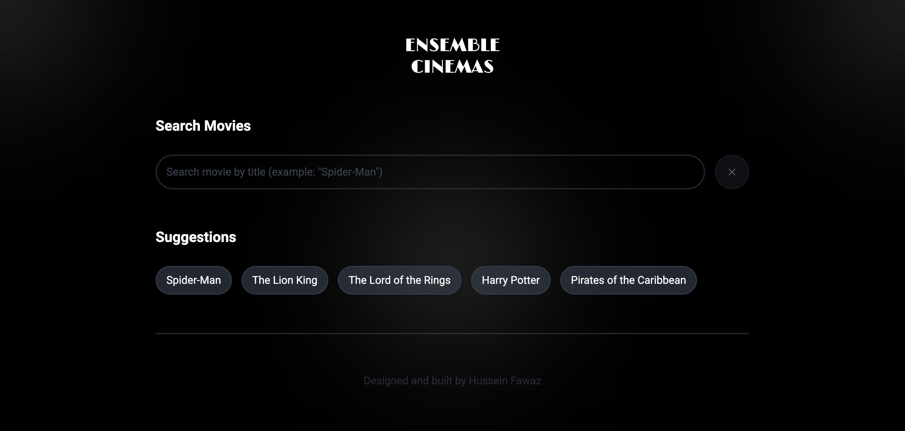
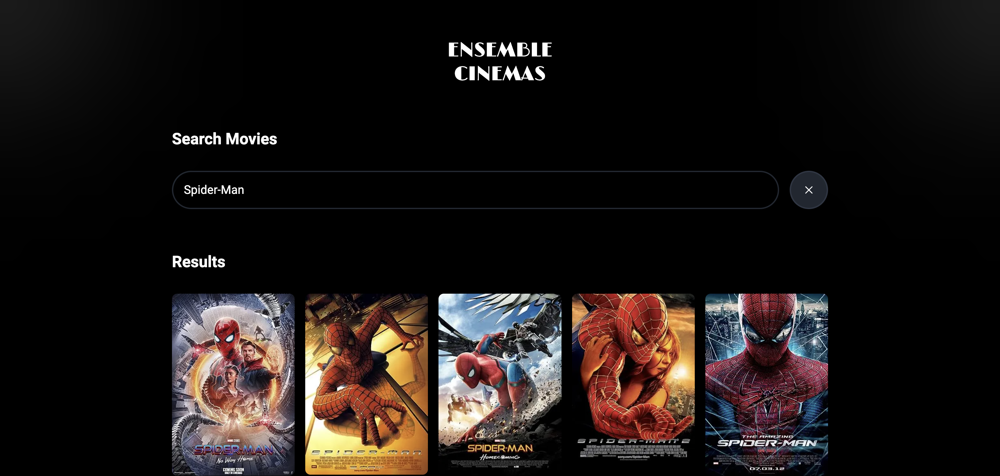

# Ensemble Cinemas




[Ensemble Cinemas](https://ensemble-cinemas.vercel.app/)

## Description
Ensemble Cinemas is a website to search and view any movie.

Users will be able to:
- Search movies by title
- Search movies by selecting a suggested search
- Search movies by selecting a recent search
- View all movies that match the given title

I chose to build Project A - App as part of Ensemble Systems's interview process. It is based on the Ensemble Developer Code Sample Submission requirements. When building this project, I made the assumption that I can add a few personal touches as long as I met the technical requirements, but without adding too much than what was requested to stay within the scope.

## Setup

Clone the repository:
```bash
git clone https://github.com/hsnfwz/ensemble-cinemas.git
```

Install dependencies:
```bash
npm install
```

Run the development server:

```bash
npm run dev
```

Create a ```.env.local``` file in the root of the project and add your OMDb API key:
```bash
OMDB_API_KEY=your_omdb_api_key
```

Open [http://localhost:3000](http://localhost:3000) with your browser to see the result!

## Branching

The following conventions were used for branching:

Branch | About
| --- | --- |
| hotfix | for quickly fixing critical issues |
| bugfix | for fixing a bug |
| feature | for adding, removing or modifying a feature |
| test | for experimenting |
| wip | for a work in progress |

## Tech Stack
The following technologies were used in the making of this project:
- [Figma](https://www.figma.com/)
- HTML
- CSS
- [Tailwind CSS](https://tailwindcss.com/)
- JavaScript
- [TypeScript](https://www.typescriptlang.org/)
- [React](https://react.dev/)
- [Next.js](https://nextjs.org/)
- [Vitest](https://vitest.dev/guide/)
- [Vercel](https://vercel.com/home)
- [OMDb API](https://www.omdbapi.com/)

## Reasons for Tech Stack

Before starting the project, I selected the tech stack that would help me achieve my goals as efficiently as possible while providing a good developer experience.

- I chose Figma for designing because of its intuitive user experience and useful features for building mockups. It is my main tool for designing and prototyping.
- I chose Next.js because it automatically sets up TypeScript, Tailwind CSS, and Vitest, provides a good developer experience when working with React, and implements many under-the-hood improvements/optimizations for my application.
- I chose TypeScript because I enjoy using data types for my JavaScript variables and functions as it helps improve my code's readability as well as robustness by catching errors before they occur.
- I chose Tailwind CSS because it implements best UI/UX design practices and helps speed up development time when styling as I do not have to switch between markup and styling files.
- I chose Vitest for testing because it is simple to set up and use for unit testing and integrates well with Next.js.
- For demonstration purposes, I deployed the app on Vercel. I chose Vercel because it integrates seamlessly with Next.js applications.

## Figma Design
To view the mockup design and details about the resources used, check out the Figma file: [Figma Design - Ensemble Cinemas](https://www.figma.com/design/stO1byZvST3tHGpiBIXwTc/Ensemble-Cinemas?node-id=0-1&t=ujfRhVpYRxY711XS-1)

## Backlog
I aim to expand and improve this project by implementing the following:
- Unit tests via Vitest
- Animations and transitions
- Different content pages

## Contributions
Designed and built by Hussein Fawaz
- [Portfolio](https://www.husseinfawaz.ca)
- [LinkedIn](https://www.linkedin.com/in/hsnfwz)
- [GitHub](https://www.github.com/hsnfwz)